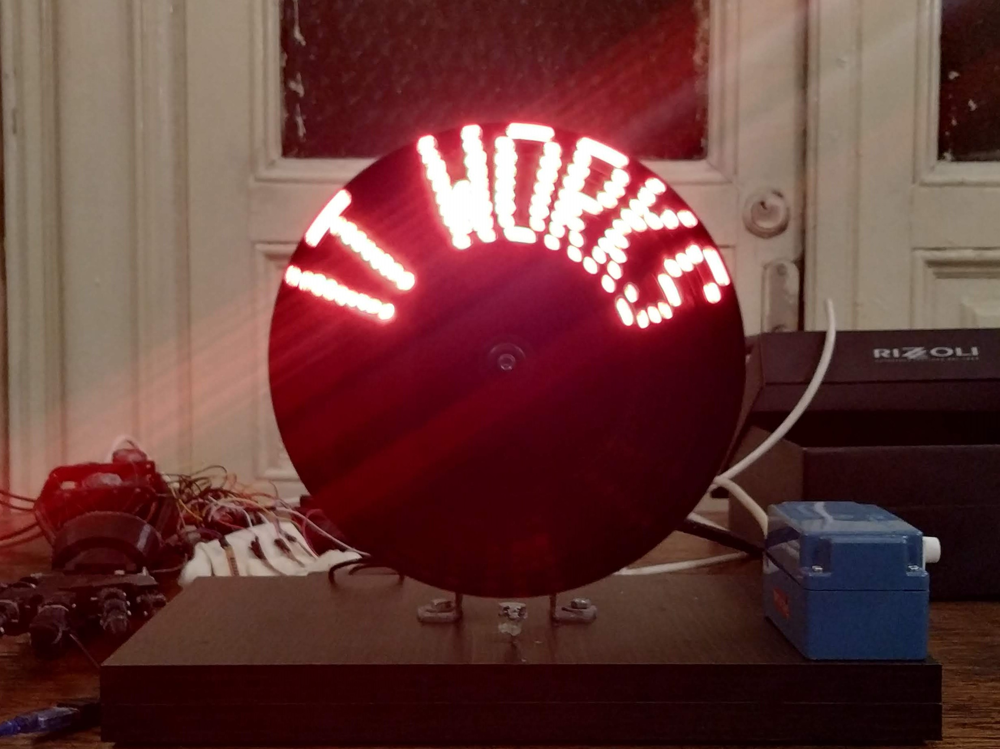

# POV-Display
_This is a project for Robotics course at University of Bucharest._ 
I used Arduino Nano and the code was written in Visual Studio, using PlatformIO plugin.   

POV display is a display which use Persistence Of Vision optical illusion that occurs when visual perception of an object does not cease for some time after the rays of light proceeding from it have ceased to enter the eye. 
In this case a single led strip, containing 9 leds, will rotate at about 20 rotation per second and in each rotation each led will be turned on/off acording to what we want to display. 
Currently we can display text and some special simbols.

## How it is used
We can connect to project bluetooth module using an app like "Serial Bluetooth Terminal" (the one I used). From here we can write what text we want to display. 
To display one word at a time you can specify this at beginnig of command like this: "\blink<time_per_word_in_millis>" and then the words separated by space. Example: "\blink1000 hello world". 
To display a special symbol wrap it in '/'. Example: "I /heart/ robotics". Currently special symbols are 'heart' and 'smiley'.

## Code Map
* src/main.cpp: code for bluetooth comunication and high level led control
* lib/LedControl: fast low level led control library
* lib/models: models for letters and special symbols
